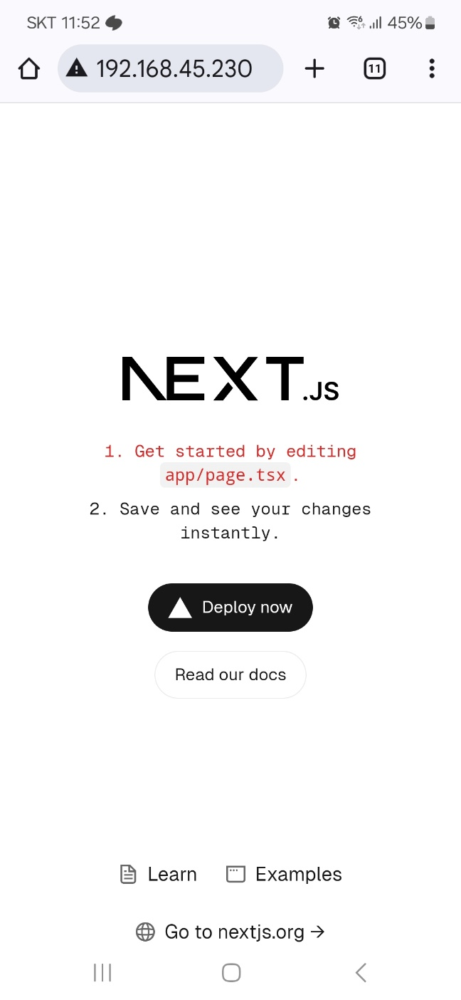
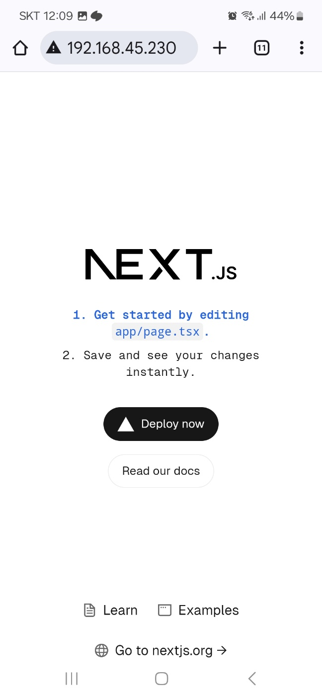

This is a [Next.js](https://nextjs.org) project bootstrapped with [`create-next-app`](https://nextjs.org/docs/app/api-reference/cli/create-next-app).
---
# Next.js 프로젝트 배포 자동화 예제 

## 개요
TypeScript 기반 Next.js 프로젝트의 배포 자동화를 위한 Docker 및 GitHub Actions 실습용 리포지토리입니다.  
배포 대상 환경 - Jetson Nano

---
### 1. Next.js 프로젝트를 위한 Dockerfile 설정
- Create Next App으로 생성한 TypeScript 기반 Next.js 프로젝트에 Dockerfile 작성.

### 2. 아키텍쳐 차이에 따른 Docker 빌드 문제
- Jetson Nano 보드는 ARM64 기반이므로 도커 빌드시 오류 발생.
  - 다단계 빌드 및 ARM64 아키텍처와의 호환성을 지원하도록 수정.
```
docker buildx build --platform linux/arm64 -t ${{secrets.IMAGE_NAME}}:latest . --push
```

### 3. Jetson Nano 배포 문제
- 클라우드 서버가 아닌 Jetson Nano에 환경을 구축했기 때문에 외부에서의 망 접근을 위한 조치 필요.
  - 포트 포워딩 및 외부 IP 설정.

### 4. GitHub Actions를 이용한 CI/CD 구성
- 다음을 포함한 GitHub Actions 워크플로우 설정:
  - ARM64 호환 Docker 이미지 빌드.
  - Docker Hub의 저장소로 이미지 푸시.
  - SSH를 이용해 Jetson Nano에 이미지 배포.
---

## YAML 구성 예시
```yaml
name: CI/CD for Next.js on Jetson Nano

on:
  push:
    branches:
      - master

jobs:
  build-and-deploy:
    name: Build and Deploy for Jetson Nano
    runs-on: ubuntu-latest

    steps:
    # 1. GitHub 저장소 체크아웃
    - name: Checkout code
      uses: actions/checkout@v3

    # 2. Docker Buildx 설치
    - name: Set up Docker Buildx
      uses: docker/setup-buildx-action@v2

    # 3. Docker Hub 로그인
    - name: Log in to Docker Hub
      uses: docker/login-action@v2
      with:
        username: ${{ secrets.DOCKER_USERNAME }}
        password: ${{ secrets.DOCKER_PASSWORD }}

    # 4. ARM 아키텍처용 Docker 이미지 빌드 및 푸시
    - name: Build and Push ARM64 Docker Image
      run: |
        docker buildx create --use
        docker buildx build --platform linux/arm64 -t ${{secrets.IMAGE_NAME}}:latest . --push

    # 5. 원격 서버로 배포
    - name: Deploy to Jetson Nano
      uses: appleboy/ssh-action@v0.1.7
      with:
        host: ${{ secrets.SERVER_HOST }}
        username: ${{ secrets.SERVER_USERNAME }}
        password: ${{ secrets.SERVER_PASSWORD }}
        script: |
          docker pull ${{secrets.IMAGE_NAME}}:latest
          docker ps -q -f "name=nextjs-app" && docker stop nextjs-app || true
          docker ps -q -f "name=nextjs-app" && docker rm nextjs-app || true
          docker run -d --name nextjs-app -p 80:3000 ${{secrets.IMAGE_NAME}}:latest
```

### 코드 수정 후 자동으로 배포까지 완료된 사진.
```html
<li className="mb-2 text-red-600">
```
```html
<li className="mb-2 text-blue-600 font-bold">
```
<center>
  
  
</center>

---
## 정리
1. 동작 흐름
    - 마스터 브랜치에 커밋 발생 시 깃허브 액션이 yml 실행.
    - 해당 커밋 내용으로 도커 이미지를 빌드 후 도커허브에 푸시.
    - 원격으로 서버 접속 후 도커허브에서 최신이미지를 내려받아 컨테이너 실행.
2. 로그인키등 민감정보는 Secrets에서 관리.
3. 아키텍쳐 AMD ARM 구분 필요.

---